<picture>
  <source media="(prefers-color-scheme: dark)" srcset="assets/banner.svg">
  
</picture>

# AI Dev Atelier

> **Mastering the New Stack.** A production-ready pack of 10 skills for code quality, documentation, code review, and research, built on the open [Agent Skills standard](https://agentskills.io/specification) and designed for OpenCode.

   

## Table of Contents

- [Overview](#overview)
- [Quick Start](#quick-start)
- [What You Get](#what-you-get)
- [Docs Index](#docs-index)
- [Prerequisites](#prerequisites)
- [Contributing](#contributing)
- [License](#license)
- [Community](#community)

## Overview

AI Dev Atelier is a curated skill pack for OpenCode. Agent Skills are a simple, open format for giving agents portable capabilities and expertise through reusable instructions, scripts, and resources. This repo provides those skills, installs them to `~/.opencode/skill`, and configures MCP servers for usage.

## What You Get

* 10 production-ready [Agent Skills](https://agentskills.io/specification) from `config/skills.json`
* 9 MCP servers configured from `config/mcps.json`
* PreToolUse guardrails defined in `config/hooks.json`


- `code-quality` — Typecheck, lint, format, Markdown validation
- `docs-check` — Detect docs needing updates from git diff
- `docs-write` — Write/update docs with standards
- `git-commit` — Write clear commits with Conventional Commits format
- `code-review` — CodeRabbit reviews (task/pr modes)
- `resolve-pr-comments` — Multi-agent PR comment resolution
- `search` — Web + library docs + GitHub code search
- `research` — Academic research with evidence cards
- `tdd` — Test-Driven Development with Testing Trophy workflow
- `ui-animation` — Tasteful UI animation & accessibility
- `use-graphite` — Manage stacked PRs with Graphite CLI

See `content/skills/README.md` for full usage details and scripts.

## Quick Start

```bash
# 1. Install AI Dev Atelier
curl -fsSL https://raw.githubusercontent.com/LukasStrickler/ai-dev-atelier/main/install.sh | bash

# 2. Verify installation
# Ask OpenCode: "What skills are available?"

# Prompt before overwriting skills
# bash ~/ai-dev-atelier/install.sh --no
```

Curl install notes:

- Cache location: `~/.config/opencode/atelier/cache/repo` (or `~/.opencode/atelier/cache/repo` if OpenCode uses `~/.opencode`).
- Add API keys in `.env` at that path (copy from `.env.example` once).
- Update by re-running the same curl command; it refreshes tracked files while keeping your `.env` and updating `.env.example`.

Install a specific ref:

```bash
AI_DEV_ATELIER_REF=<branch-or-tag> curl -fsSL \
  https://raw.githubusercontent.com/LukasStrickler/ai-dev-atelier/<branch-or-tag>/install.sh | bash
```

If you prefer a local checkout (recommended for dev work):

```bash
git clone https://github.com/LukasStrickler/ai-dev-atelier.git ~/ai-dev-atelier

# Install local changes into OpenCode
make -C ~/ai-dev-atelier install

# Validate skill structure
make -C ~/ai-dev-atelier validate

# Prompt before overwriting skills
bash ~/ai-dev-atelier/install.sh --no
```

## Docs Index

| Document | Purpose |
|----------|---------|
| [INSTALL.md](./INSTALL.md) | Dependencies and MCP setup |
| [content/skills/README.md](./content/skills/README.md) | Skill catalog and usage reference |
| [AGENTS.md](./AGENTS.md) | Developer workflow guide and MCP reference |
| [MY_AGENTIC_DEV_SETUP.md](./MY_AGENTIC_DEV_SETUP.md) | OpenCode + Vibora + oh-my-opencode workflow |

## Prerequisites

- **Git**
- **Bash 4.0+**
- **Node.js 18+** or **Bun** (for `code-quality` tooling)
- **OpenCode** (skills runtime)
- **jq** (optional, required for MCP config automation)

`install.sh` checks dependencies and prompts to install missing packages when possible.

See [INSTALL.md](./INSTALL.md) for platform-specific installation commands and optional tools.

## Contributing

1. Run `make test` before committing.
2. Keep instructions and scripts inside `content/skills/`.
3. Update `content/skills/README.md` when the catalog changes.
4. Keep outputs under `.ada/`.

## License

Business Source License 1.1. Change License: Apache 2.0. See [LICENSE](./LICENSE).

## Community

- **Issues**: Report bugs or request features via [GitHub Issues](https://github.com/LukasStrickler/ai-dev-atelier/issues)
